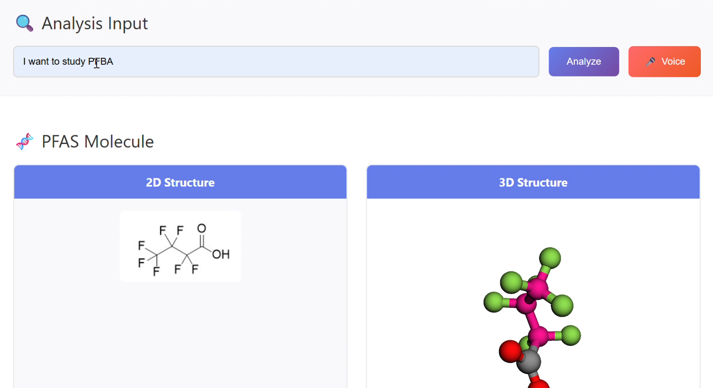

# PFAS-Catch 🧪

**{Tech: Berlin } AI Hackathon Berlin 2025 - General Track**
*"AI-chemist" - AI for Molecular Discovery*

An intelligent agent that transforms natural language descriptions into molecular discovery and visualization based on Molecular Dynamics performed on various adsorbers for PFAS removal.

Here is the video demonstration of the submission: [](https://drive.google.com/file/d/1q7I1suQlWol1CHcKXmZfSbBtwTPGl6Eh/view?usp=drive_link)

## 🚀 Features

- Natural language PFAS intepretation
- Best adsorber molecular search for removing a given PFAS
- 2D and 3D molecular visualization
- SMILES parsing and validation
- Automated binding and property analysis

## 📁 Project Structure

```
pfas-catch/
├── main.py                # FastAPI app and endpoints
├── thermoanalysis.py      # Thermodynamic analysis logic
├── analysis/              # Domain-specific analysis modules
├── data/                  # Chemical datasets
├── images/                # 2D/3D molecular images and mol2 files
├── src/                   # Core source code
├── README.md
├── pyproject.toml         # Python dependencies
└── .gitignore
```

## 🛠️ Setup & Running the FastAPI App

1. **Clone the repository**
    ```bash
    git clone <repository-url>
    cd pfas-catch
    ```

2. **Install dependencies**
    ```bash
    uv sync
    ```

3. **Configure environment variables**  
   Copy the example config and add your API keys if required:
    ```bash
    cp config/env.example .env
    # Edit .env as needed
    ```

4. **Run the FastAPI app**
    ```bash
    uv run python main.py
    ```
    The app will start at [http://127.0.0.1:8000](http://127.0.0.1:8000).

## 🧪 Example Endpoints

- `GET /app`: Run the full HTML app for the adsorber selection
- `POST /smiles`: Get SMILES from molecule description
- `POST /render2d`: Get 2D image from SMILES
- `POST /render3d`: Get 3D mol2 file from SMILES

## 📄 License

MIT License - TechEurope Hackathon Berlin 2025

---

*"Where AI meets molecular discovery - autonomous agents for scientific breakthrough"*
